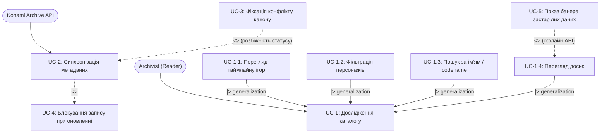

```mermaid
flowchart TD
    %% Actors
    Archivist(["Archivist (Reader)"])
    KonamiAPI(["Konami Archive API"])

    %% Base Use Case
    UC_Explore["UC-1: Дослідження каталогу"]

    %% Generalization Use Cases
    UC_Timeline["UC-1.1: Перегляд таймлайну ігор"]
    UC_Filter["UC-1.2: Фільтрація персонажів"]
    UC_Search["UC-1.3: Пошук за ім'ям / codename"]
    UC_Dossier["UC-1.4: Перегляд досьє"]

    %% Backend / API Use Cases
    UC_Sync["UC-2: Синхронізація метаданих"]
    UC_Conflict["UC-3: Фіксація конфлікту канону"]
    UC_Lock["UC-4: Блокування запису при оновленні"]
    UC_Stale["UC-5: Показ банера застарілих даних"]

    %% Actor Connections
    Archivist --> UC_Explore
    KonamiAPI --> UC_Sync

    %% Generalization Hierarchy
    UC_Timeline -- "|> generalization" --> UC_Explore
    UC_Filter -- "|> generalization" --> UC_Explore
    UC_Search -- "|> generalization" --> UC_Explore
    UC_Dossier -- "|> generalization" --> UC_Explore

    %% Includes & Extends
    UC_Sync -. "<<include>>" .-> UC_Lock
    UC_Conflict -. "<<extend>> (розбіжність статусу)" .-> UC_Sync
    UC_Stale -. "<<extend>> (офлайн API)" .-> UC_Dossier
```