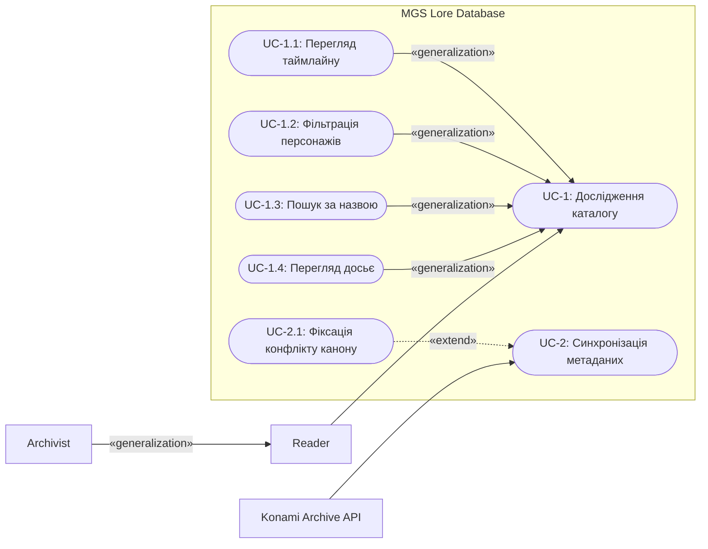

```mermaid
flowchart LR
    %% Actors
    Reader["Reader"]
    Archivist["Archivist"]
    KonamiAPI["Konami Archive API"]

    %% Actor Generalization (Specialized -> Base)
    Archivist -->|"«generalization»"| Reader

    %% System Boundary
    subgraph System ["MGS Lore Database"]
        direction TB

        %% Catalog Use Cases
        UC1(["UC-1: Дослідження каталогу"])
        UC1_1(["UC-1.1: Перегляд таймлайну"])
        UC1_2(["UC-1.2: Фільтрація персонажів"])
        UC1_3(["UC-1.3: Пошук за назвою"])
        UC1_4(["UC-1.4: Перегляд досьє"])

        %% Sync & Conflict Use Cases
        UC2(["UC-2: Синхронізація метаданих"])
        UC2_1(["UC-2.1: Фіксація конфлікту канону"])

        %% Use Case Generalization (Specialized -> Base)
        UC1_1 -->|"«generalization»"| UC1
        UC1_2 -->|"«generalization»"| UC1
        UC1_3 -->|"«generalization»"| UC1
        UC1_4 -->|"«generalization»"| UC1

        %% Extension points (Extension -> Base)
        UC2_1 -.->|"«extend»"| UC2
    end

    %% Primary Associations
    Reader --> UC1
    KonamiAPI --> UC2
```