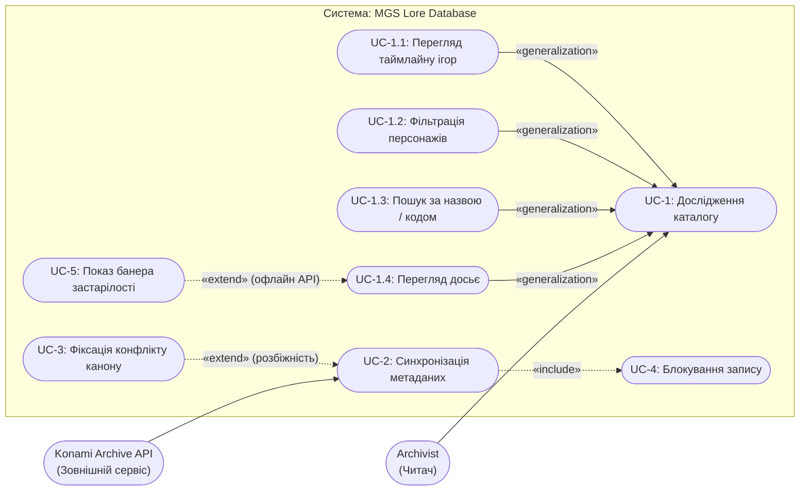

```mermaid
flowchart LR
    %% Actors
    Archivist(["Archivist<br/>(Читач)"])
    KonamiAPI(["Konami Archive API<br/>(Зовнішній сервіс)"])

    %% System Boundary
    subgraph System ["Система: MGS Lore Database"]
        direction TB

        %% Core Use Cases
        UC_Explore(["UC-1: Дослідження каталогу"])
        UC_Timeline(["UC-1.1: Перегляд таймлайну ігор"])
        UC_Filter(["UC-1.2: Фільтрація персонажів"])
        UC_Search(["UC-1.3: Пошук за назвою / кодом"])
        UC_Dossier(["UC-1.4: Перегляд досьє"])

        %% Additional Use Cases
        UC_Sync(["UC-2: Синхронізація метаданих"])
        UC_Conflict(["UC-3: Фіксація конфлікту канону"])
        UC_Lock(["UC-4: Блокування запису"])
        UC_Stale(["UC-5: Показ банера застарілості"])

        %% Generalization
        UC_Timeline -->|"«generalization»"| UC_Explore
        UC_Filter -->|"«generalization»"| UC_Explore
        UC_Search -->|"«generalization»"| UC_Explore
        UC_Dossier -->|"«generalization»"| UC_Explore

        %% Include relationships
        UC_Sync -.->|"«include»"| UC_Lock

        %% Extend relationships
        UC_Conflict -.->|"«extend» (розбіжність)"| UC_Sync
        UC_Stale -.->|"«extend» (офлайн API)"| UC_Dossier
    end

    %% Actor to Use Case Links
    Archivist --> UC_Explore
    KonamiAPI --> UC_Sync

```