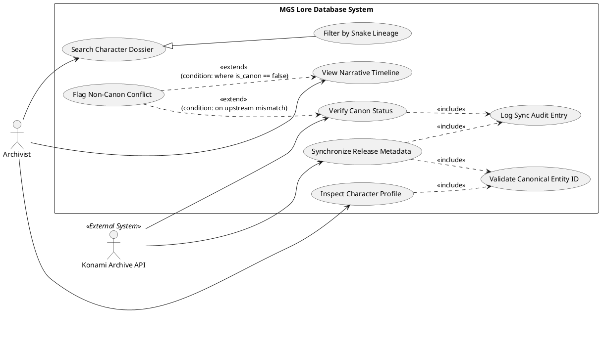

```plantuml
@startuml
left to right direction
skinparam packageStyle rectangle

actor "Archivist" as User
actor "Konami Archive API" as API <<External System>>

rectangle "MGS Lore Database System" {
  ' Базові прецеденти
  usecase "Search Character Dossier" as UC_Search
  usecase "Filter by Snake Lineage" as UC_FilterSnake
  usecase "View Narrative Timeline" as UC_Timeline
  usecase "Inspect Character Profile" as UC_Inspect
  
  ' Прецеденти синхронізації
  usecase "Synchronize Release Metadata" as UC_SyncMeta
  usecase "Verify Canon Status" as UC_VerifyCanon
  
  ' Допоміжні / розширені прецеденти
  usecase "Validate Canonical Entity ID" as UC_ValidateID
  usecase "Flag Non-Canon Conflict" as UC_FlagConflict
  usecase "Log Sync Audit Entry" as UC_LogAudit
}

' Generalization (Узагальнення)
UC_FilterSnake -up-|> UC_Search

' Взаємодія користувача
User --> UC_Search
User --> UC_Timeline
User --> UC_Inspect

' Взаємодія зовнішнього API
API --> UC_SyncMeta
API --> UC_VerifyCanon

' Зв'язки <<include>>
UC_Inspect ..> UC_ValidateID : <<include>>
UC_SyncMeta ..> UC_ValidateID : <<include>>
UC_SyncMeta ..> UC_LogAudit : <<include>>
UC_VerifyCanon ..> UC_LogAudit : <<include>>

' Зв'язки <<extend>>
UC_FlagConflict ..> UC_Timeline : <<extend>> \n(condition: where is_canon == false)
UC_FlagConflict ..> UC_VerifyCanon : <<extend>> \n(condition: on upstream mismatch)

@enduml

```