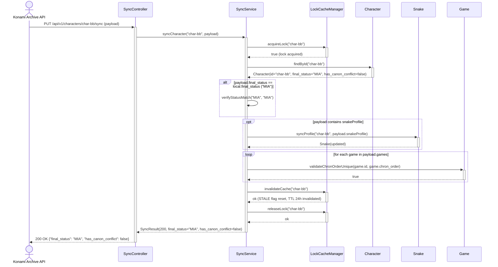
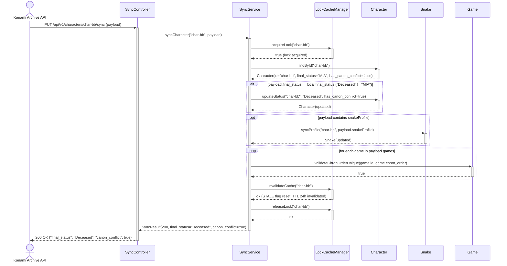
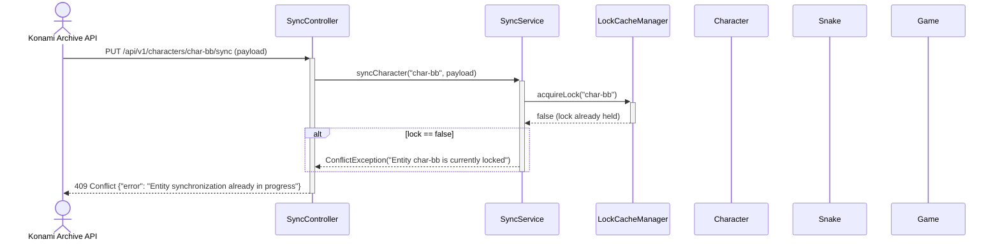
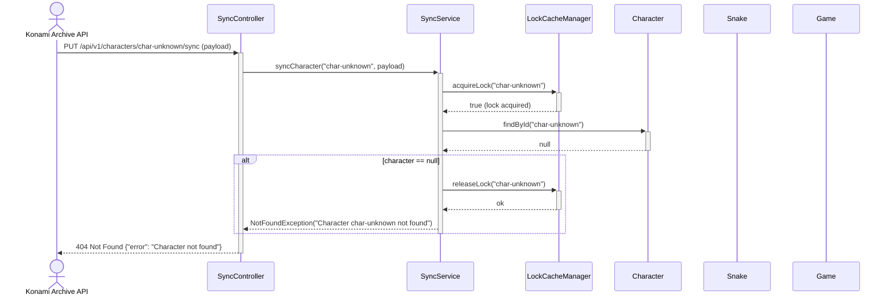

:warning: == Scenario 1: Happy path ==

```mermaid
sequenceDiagram
    actor API as Konami Archive API
    participant Ctrl as SyncController
    participant Svc as SyncService
    participant LCM as LockCacheManager
    participant Char as Character
    participant Snake as Snake
    participant Game as Game

    API->>+Ctrl: PUT /api/v1/characters/char-bb/sync (payload)
    Ctrl->>+Svc: syncCharacter("char-bb", payload)
    Svc->>+LCM: acquireLock("char-bb")
    LCM-->>-Svc: true (lock acquired)

    Svc->>+Char: findById("char-bb")
    Char-->>-Svc: Character(id="char-bb", final_status="MIA", has_canon_conflict=false)

    alt payload.final_status == local.final_status ("MIA")
        Svc->>Svc: verifyStatusMatch("MIA", "MIA")
    end

    opt payload contains snakeProfile
        Svc->>+Snake: syncProfile("char-bb", payload.snakeProfile)
        Snake-->>-Svc: Snake(updated)
    end

    loop for each game in payload.games
        Svc->>+Game: validateChronOrderUnique(game.id, game.chron_order)
        Game-->>-Svc: true
    end

    Svc->>+LCM: invalidateCache("char-bb")
    LCM-->>-Svc: ok (STALE flag reset, TTL 24h invalidated)

    Svc->>+LCM: releaseLock("char-bb")
    LCM-->>-Svc: ok

    Svc-->>-Ctrl: SyncResult(200, final_status="MIA", has_canon_conflict=false)
    Ctrl-->>-API: 200 OK {"final_status": "MIA", "has_canon_conflict": false}
```

:warning: == Scenario 2: Conflict path == 

```mermaid
    sequenceDiagram
    actor API as Konami Archive API
    participant Ctrl as SyncController
    participant Svc as SyncService
    participant LCM as LockCacheManager
    participant Char as Character
    participant Snake as Snake
    participant Game as Game

    API->>+Ctrl: PUT /api/v1/characters/char-bb/sync (payload)
    Ctrl->>+Svc: syncCharacter("char-bb", payload)
    Svc->>+LCM: acquireLock("char-bb")
    LCM-->>-Svc: true (lock acquired)

    Svc->>+Char: findById("char-bb")
    Char-->>-Svc: Character(id="char-bb", final_status="MIA", has_canon_conflict=false)

    alt payload.final_status != local.final_status ("Deceased" != "MIA")
        Svc->>+Char: updateStatus("char-bb", "Deceased", has_canon_conflict=true)
        Char-->>-Svc: Character(updated)
    end

    opt payload contains snakeProfile
        Svc->>+Snake: syncProfile("char-bb", payload.snakeProfile)
        Snake-->>-Svc: Snake(updated)
    end

    loop for each game in payload.games
        Svc->>+Game: validateChronOrderUnique(game.id, game.chron_order)
        Game-->>-Svc: true
    end

    Svc->>+LCM: invalidateCache("char-bb")
    LCM-->>-Svc: ok (STALE flag reset, TTL 24h invalidated)

    Svc->>+LCM: releaseLock("char-bb")
    LCM-->>-Svc: ok

    Svc-->>-Ctrl: SyncResult(200, final_status="Deceased", canon_conflict=true)
    Ctrl-->>-API: 200 OK {"final_status": "Deceased", "canon_conflict": true}
```

:warning: == Scenario 3: Lock / edge case == 

```mermaid
sequenceDiagram
    actor API as Konami Archive API
    participant Ctrl as SyncController
    participant Svc as SyncService
    participant LCM as LockCacheManager
    participant Char as Character
    participant Snake as Snake
    participant Game as Game

    API->>+Ctrl: PUT /api/v1/characters/char-bb/sync (payload)
    Ctrl->>+Svc: syncCharacter("char-bb", payload)
    Svc->>+LCM: acquireLock("char-bb")
    LCM-->>-Svc: false (lock already held)

    alt lock == false
        Svc-->>Ctrl: ConflictException("Entity char-bb is currently locked")
    end

    deactivate Svc
    Ctrl-->>-API: 409 Conflict {"error": "Entity synchronization already in progress"}
```

:warning: == Scenario 4: Error path == 

```mermaid
sequenceDiagram
    actor API as Konami Archive API
    participant Ctrl as SyncController
    participant Svc as SyncService
    participant LCM as LockCacheManager
    participant Char as Character
    participant Snake as Snake
    participant Game as Game

    API->>+Ctrl: PUT /api/v1/characters/char-unknown/sync (payload)
    Ctrl->>+Svc: syncCharacter("char-unknown", payload)
    Svc->>+LCM: acquireLock("char-unknown")
    LCM-->>-Svc: true (lock acquired)

    Svc->>+Char: findById("char-unknown")
    Char-->>-Svc: null

    alt character == null
        Svc->>+LCM: releaseLock("char-unknown")
        LCM-->>-Svc: ok
        Svc-->>Ctrl: NotFoundException("Character char-unknown not found")
    end

    deactivate Svc
    Ctrl-->>-API: 404 Not Found {"error": "Character not found"}
```